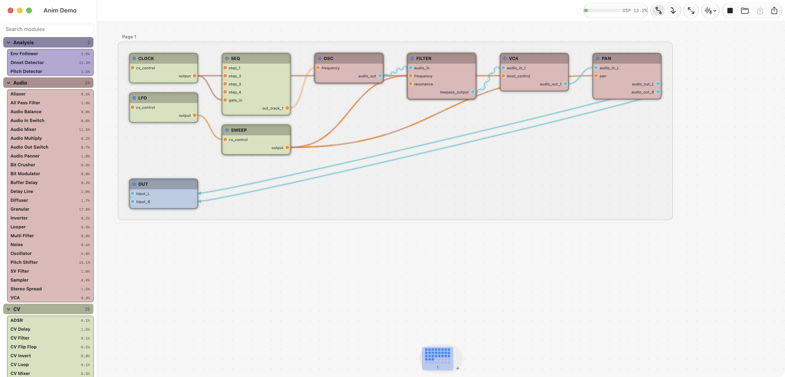

# ZOIA Canvas

Design [Empress Effects ZOIA](https://empresseffects.com/products/zoia) patches
on your Mac — a full-screen node canvas instead of one button at a time on the
pedal. Open real `.bin` patch files, rewire and tweak them, hear them play, and
save files the pedal loads straight from its SD card.


## Features

- **Node canvas** — every module is a node, every connection is a cable you can
  see. Pages appear as side-by-side framed bands, with an LED-grid preview of
  each page in the bar along the bottom.
- **Live playback** — press Play and hear the patch through a built-in audio
  engine. Signal animates through the canvas: audio wires draw the waveform
  they carry, CV cables pulse as gates travel, cables blush red/blue as values
  rise and fall, and modules glow with their output.
- **Full editing** — add modules from the searchable palette, wire by dragging
  between ports, set every option and parameter in the inspector, name and
  color modules, organize pages.
- **Pedal-true layout** — the inspector shows each page as the 8×5 button grid
  the pedal will display, and you drag modules to the buttons you want.
  Placement is sticky: nothing moves unless you move it or something you moved
  displaces it.
- **A window per patch** — open several patches side by side to compare them.
  Each window remembers its size and position, and every patch remembers your
  canvas arrangement, zoom, and pan for the next time you open it.
- **Real patch files** — the `.bin` format is byte-verified against the entire
  ZOIA and Euroburo factory patch libraries. What you save is what the pedal
  reads.



## Installing

Build from source (requires Xcode and [xcodegen](https://github.com/yonaskolb/XcodeGen)):

```
xcodegen
xcodebuild -scheme ZoiaCanvas build
```

The app lands in Xcode's DerivedData products folder; drag `ZoiaCanvas.app`
wherever you like.

## Opening patches

Any of:

- **⌘O** or the folder button in the toolbar
- Drag a `.bin` anywhere onto a window
- Double-click a `.bin` in Finder (ZOIA Canvas registers as an editor)

Each patch gets its own window; an open only takes over the window you're in
when it's an empty untitled one. **⌘N** starts a fresh patch in a new window.

On launch the app reopens your whole workspace — every patch window you had
open at quit, each where you left it. Patches straight off the pedal's SD card
open as-is: the first open arranges the modules circuit-style —
signal flowing left to right — and after that, every patch reopens exactly the
way you arranged it.

## Working the canvas

| Action | How |
| --- | --- |
| Pan | two-finger scroll, or drag empty canvas |
| Zoom | pinch, or ⌘+ / ⌘− / ⌘0 to reset |
| Add a module | drag it from the palette, or click it to drop one in |
| Move a module | drag its body |
| Select | click a module or cable |
| Delete | ⌫ or ⌘⌫ on the selection, or right-click a module |
| Wire | drag from an output port to an input port |
| Re-route a wire | drag it off the input port it's plugged into, drop it on another — drop on empty space to disconnect |
| Jump between pages | click a page tile in the bottom bar |

Audio ports are blue, CV ports orange. The app enforces output→input
direction and warns (without blocking) when you cross audio and CV — the pedal
allows it, so the canvas does too. Cable style (curved or angular) is a toolbar
toggle, as is the expanded layout that gives every cross-page connection its
own connector card.

## The inspector

Click a module and the right panel shows everything about it:

- **Name and color** — what the pedal displays and the LED color it lights.
- **Grid** — the module's page as the pedal's 8×5 button grid. Drag the module
  to the buttons you want; whatever you drop on steps aside and comes back if
  you keep dragging. A page over its 40 buttons shows a warning and blocks
  saving until it fits.
- **Options** — every catalog option; changing one re-lays-out the module's
  blocks live, exactly as the pedal does.
- **Params** — a slider per parameter, readable as raw CV or as the MIDI note
  the pitch mapping lands on.

## Playing patches

Press **Play** in the toolbar. The engine renders the patch in real time
through your output device; the **Input** menu picks what feeds the patch's
audio-input modules — the microphone, or a loopback device like BlackHole to
route another app in. The DSP meter estimates load the way the pedal's own
meter does.

A growing subset of the module catalog is implemented in the engine;
unimplemented modules pass silence. Pitch and LFO response curves are
documented approximations pending calibration against hardware — trust the
pedal's ears over the preview.

## Saving

**⌘S** saves back to the open file, **⇧⌘S** saves as a new file and keeps
working there. The title shows `*` while there are unsaved changes; an
untitled patch asks where to live the first time.

Copy the saved `.bin` to the pedal's SD card and load it like any other patch.

## For developers

The project is SwiftUI, generated by `xcodegen` from `project.yml`, with a
test suite covering the codec (oracle-tested against
[zoia_lib](https://github.com/meanmedianmoge/zoia_lib)'s parser over the full
factory corpus), the block-layout engine, grid placement, and the audio
runtime. `xcodebuild -scheme ZoiaCanvas test` runs everything. The patch
binary format and module metadata derive from zoia_lib (GPL-3.0) and
Empress's firmware-5 module index.

## License

GPL-3.0 — see LICENSE.
